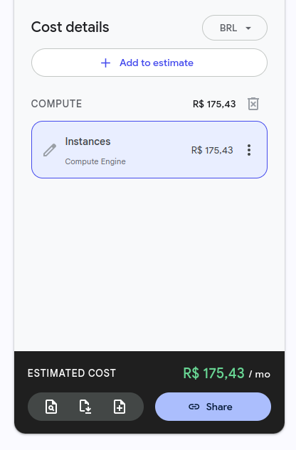
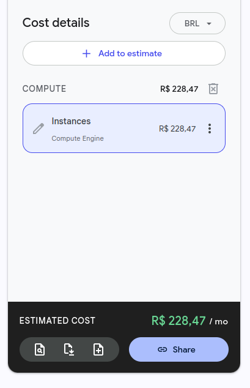
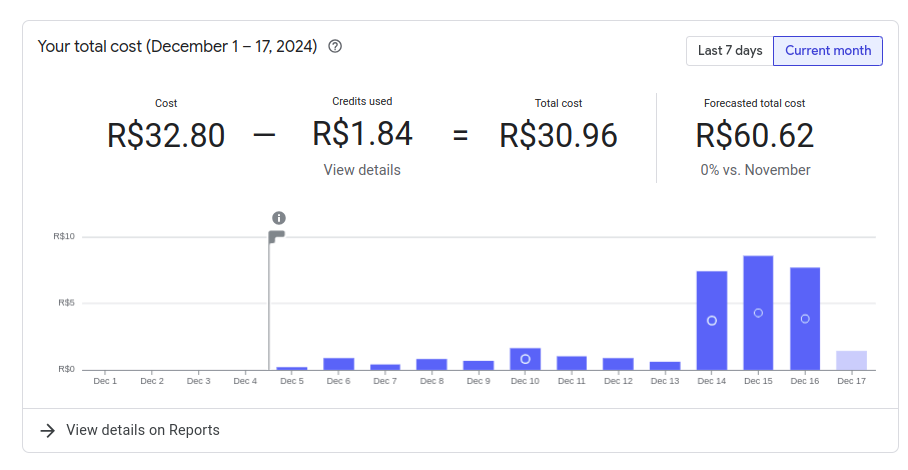

# 1 - Sobre a infraestrutura:

O servidor para infraestrutura escolhido foi o Google Cloud Plataform(GCP). As motivações que embasam essa escolha são custo, simplicidade, familiaridade, além da estrutura robusta e confiável da Google. Nessa infraestrutura, é possível associar outros serviços e API's do GCP com o projeto, estruturando e evoluindo mais ainda as possibilidades e o alcance do projeto. 

O serviço do GCP escolhido foi o Compute Engine, que realiza a provisão de máquinas virtuais, com diversas possibilidades de RAM, Disco, tipo de máquina, otimização do comportamento e perfil do processamento, sistema operacional, e funções adicionais como: inicialização por imagens prévias, associação com Load Balacing, serviços de análise e inteligência. Há possibilidades de migração para o serviço de Kubernets do GCP(GKE), futuramente, em caso de maiores investimentos externos e pós-disciplina. 

# 2 - Custos

A política inicial do projeto, a respeito dos custos, é a busca pelo gasto mínimo para execução da primeira versão do projeto - quando não "free tier". Como o grupo contém 15 integrantes, entende-se que o valor de contribuição será melhor diluído. 

O planejamento para a estrutura do deploy que comportá o projeto foi inicialmente desenhado para: Uma maquína Virtual com especificações: 1 vCPU, 4 GB de RAM e 20 GB de memória; Uma rede padrão para realizar a comunicação, e Regras no Firewall. Todo o sistema foi planejado para ser deployado em apenas uma máquina, ou seja: frontend, backend e banco. Tecnicamente, é arriscado deployar uma estrutura assim, porque em caso de desastre, considerando um caso simplista sem backup ou cópias estruturais em zonas diferentes, há dois prejuízos: Prejuízo estrutural, onde a estrutura criada pode ser perdida; e prejuízo com o cliente, já que o serviço vai ficar fora do ar e o cliente perderá recursos. A forma mais correta de se deployar uma estrutura assim seria com uma máquina para cada parte desse projeto, e o backend associado com o próprio serviço de banco relacional que o GCP possui, o Cloud SQL. Desacoplar esse sistema, mas manter a comunicação de forma forte e estruturada é ideal. No nosso caso, o projeto ainda não possui alta demanda de acessos, nem é tão robusto ao ponto de necessitar esse tipo de estrutura. Portanto, definimos esse estado planejado como o mais aceitável e econômico. O valor obtido especifica uma máquina ligada 24/7 utilizando todos seus recursos.

Devido a alterações na estrutura do projeto, foi necessário alocar memória adicional para comportar a execução. Atualmente, as especificações da máquina continuam as mesmas, com exceção da memória que partiu de 20GB para 100GB. A Google cobra atualmente(Dezembro/2024) aproximadamente 1 dólar a mais para cada 10GB, e no momento da necessidade de extesão de memória, teve uma perda considerável de tempo para consertar e reestruturar a máquina. Portanto, justifica-se esse acréscimo em 80GB baseado no fator de custo: ainda encontra-se no nosso orçamento; e no fator expansividade: não queremos mais ter problemas próximos a datas importantes de ponto de controle. 

Valer ressaltar que, enquanto não há a entrega final do produto para o cliente e em épocas fora de avaliação, o ambiente de produção será desligado para economizar recursos. O Deploy continuará ocorrendo, mas sem tanta exposição da máquina. Por conta disso, o valor previsto na imagem pode ser menor, porém nunca extrapolando o máximo previsto.

Com relação a custos é isso. Por ter aporte inicial do próprio grupo, foi tudo bastante planejado para evitar surpresas desagradáveis e não pesarpara ninguém. 

Atualmente, os custos previstos se encontram em:

# 3 - A Estrutura Interna

O Projeto consta com duas execuções de dockercompose para cada frente. São 6 imagens para o backend: Microserviço Usuários, Microserviço Aplicação, Banco Usuários, Banco Aplicação, NATS, Microserviço API Gateway; e apenas 1 imagem para o frontend: Frontend. No momento há duas ativações via docker-compose. Inicialmente, apenas 1 docker-compose foi planejado. Para o frontend não havia necessidade, porque não há nada mais acoplado que seja importante subir junto desse serviço. Entretanto, para resolulção de problemas no período de testes, incorpou-se o docker-compose para o frontend. A motivação foi que o frontend não estava "segurando" no deploy, depois de minutos deployado, apenas o backend ficava no ar e o frontend caia. Isso tem a ver com a sessão de usuário dentro das máquinas virtuais. Se fosse usado docker-compose, e o serviço rodando por trás como o backend, solucionária esse problema.

Com isso em mente, alteramos apenas a versão deployada para conter um docker-compose ativo no frontend. E isso resolveu todos os problemas encontrados. Atualmente, basta acessar o ip da máquina na porta 3000, e pronto. 

# 4 - Sobre a esteira de processos CI/CD

O projeto consta com esteiras de CI planejadas e estruturadas para Backend e Frontend, e esteiras de CD planejadas porém não estruturadas ainda. 